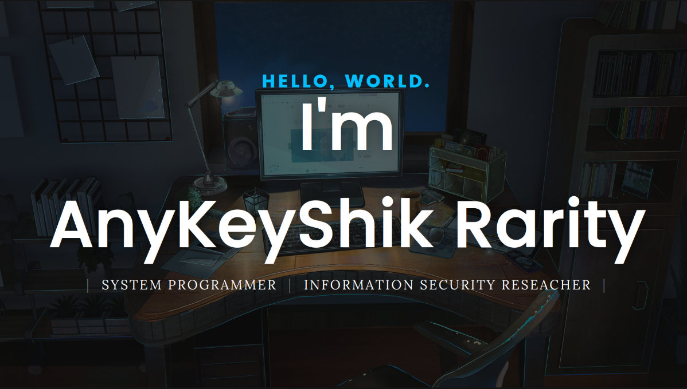

  

<ul>
  <li>Passionate about programming, anime and modeling.</li>
  <li>I like to explore unusual use of well-known tools. Also I interested in system administration.</li>
  <li>I work as a Security Reseacher at <a href="https://www.ptsecurity.com" target="_blank">Positive Technologies</a>.</li>
  <li>I have intermediate English.</li>
  <li>I usually like to play <a href="https://tracker.gg/lol/profile/riot/Miko%20Chan%23Iino/overview" target="_blank">League of Legends</a>, <a href="https://worldofwarcraft.blizzard.com/en-us/character/eu/howling-fjord/%D0%9B%D0%B8%D0%B7%D0%B7%D0%BB%D0%B5%D1%82%D1%82" target="_blank">World of Warcraft</a>, and Visual Novels.</li>
  <li>
    

      
Curiosities:

      <ul>
        <li>My beloved game in childhood is a "Let's fail Windows into BSOD".</li>
        <li>I've watched over 600 animes.</li>
      </ul>
    

  </li>
</ul>
    

<table>
  <tr>
    <td align="center">
       
      
        <b>
          <pre>Bash</pre>
        </b>
      
    </td>
    <td align="center">
       
      
        <b>
          <pre>BSD</pre>
        </b>
      
    </td>
    <td align="center">
       
      
        <b>
          <pre>C</pre>
        </b>
      
    </td>
    <td align="center">
       
      
        <b>
          <pre>CMake</pre>
        </b>
      
    </td>
    <td align="center">
       
      
        <b>
          <pre>Bots</pre>
        </b>
      
    </td>
    <td align="center">
         
        
          <b>
            <pre>Docker</pre>
          </b>
        
    </td>
    <td align="center">
         
        
          <b>
            <pre>Git</pre>
          </b>
        
    </td>
    <td align="center">
         
        
          <b>
            <pre>LaTeX</pre>
          </b>
        
    </td>
    <td align="center">
         
        
          <b>
            <pre>Linux</pre>
          </b>
        
    </td>
    </tr>
    <tr>
    <td align="center">
       
      
        <b>
          <pre>NeoVim</pre>
        </b>
      
    </td>
    <td align="center">
       
        
          <b>
            <pre>nginx</pre>
          </b>
        
    </td>
    <td align="center">
         
        
          <b>
            <pre>Python</pre>
          </b>
        
    </td>
    <td align="center">
         
        
          <b>
            <pre>C++</pre>
          </b>
      
    </td>
  </tr>
</table>

   

  <a href="mailto:nikitav59@gmail.com" target="_blank">
    
    &nbsp;
  </a>
  <a href="https://t.me/AnyKeyShik" target="_blank">
    
    &nbsp;
  </a>

   

<table height="750px" align="right">
  <tr>
    <td>
    
    </td>
  </tr>
  <tr>
    <td>
    
    </td>
  </tr>
  <tr>
    <td>
    
    </td>
  </tr>
</table>

  
  

